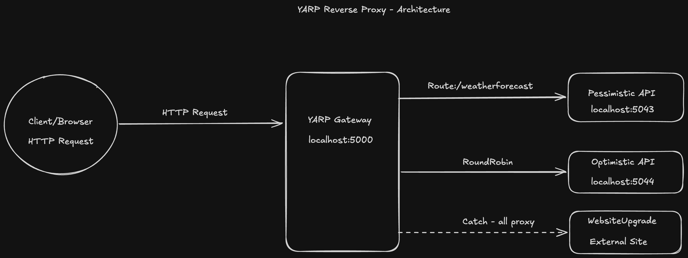

# YARP

Playing around with YARP a reverse proxy toolkit by Microsoft for .NET applications, sits between client and server forwarding requests and enabling features like:
 - Request Routing
 - Load Balacing across multiple backends
 - Health Checks
 - Request/Response ransformation


 ## Solution Structure
 
```
LoadBalancerSolution/
├── YARPGateway/          → YARP reverse proxy (entry point for all requests)
├── OptimisticApi/         → Backend server 1 (Weather API)
├── PessimisticApi/         → Backend server 2 (Weather API)
└── WebsiteUpgrade/       → Proxy to external site with Razor Pages overlay

```

## YARP
### YARPGateway
The core reverse proxy. All incoming requests hit this first. YARP reads the route and cluster configuration from `appsettings.json` and forwards requests to the appropriate upstream server.
 
- Built with ASP.NET Core + YARP
- Configured via `appsettings.json` (no code changes needed to update routing)
- Supports multiple destination clusters


